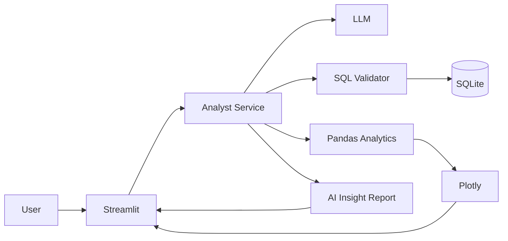

# AI Data Analyst Copilot

A job-ready GenAI + Data Analytics portfolio project. Ask business questions in natural language and get SQL, data results, interactive charts, and AI-written insights.

## Features
- Natural language → read-only SQL
- SQL validation/guardrails
- SQLite local database with realistic retail data
- CSV ingestion
- Data-quality checks
- Automatic Plotly visualization
- AI-generated business insights
- What-if revenue scenarios
- Simple revenue forecasting
- Streamlit UI
- Tests, Docker, and GitHub Actions

## Architecture



## Quick start

### 1. Clone and install
```bash
git clone https://github.com/YOUR_USERNAME/ai-data-analyst-copilot.git
cd ai-data-analyst-copilot

python -m venv .venv
# Windows:
.venv\Scripts\activate
# macOS/Linux:
# source .venv/bin/activate

pip install -r requirements.txt
```

### 2. Configure
```bash
cp .env.example .env
```
Add an LLM API key if you want AI SQL/insights. The app still works in demo mode without one.

### 3. Create the sample database
```bash
python scripts/seed_database.py
```

### 4. Run
```bash
streamlit run app.py
```

Open the local URL shown by Streamlit.

## Example questions
- What are the top 10 products by revenue?
- Show monthly revenue.
- Which region has the highest profit?
- Compare revenue by category.
- Which customers generated the most revenue?

## Project structure
```text
ai-data-analyst-copilot/
├── app.py
├── requirements.txt
├── .env.example
├── .gitignore
├── Dockerfile
├── docker-compose.yml
├── LICENSE
├── README.md
├── data/
│   └── .gitkeep
├── scripts/
│   └── seed_database.py
├── src/
│   ├── __init__.py
│   ├── config.py
│   ├── database.py
│   ├── llm.py
│   ├── prompts.py
│   ├── sql_guard.py
│   ├── analytics.py
│   ├── charts.py
│   ├── agent.py
│   └── quality.py
├── tests/
│   ├── test_sql_guard.py
│   └── test_analytics.py
└── .github/workflows/ci.yml
```

## Resume bullets
- Built an AI Data Analyst Copilot that converts natural-language business questions into validated read-only SQL and interactive analytics.
- Integrated Python/Pandas, SQL, Plotly and an LLM API to automate KPI analysis, visualization and business insight generation.
- Implemented SQL guardrails, data-quality checks, forecasting and what-if analysis in a Streamlit application.

## Security
Never commit `.env` or API keys. The SQL layer only permits read-only statements. For production, use a dedicated read-only database user, query timeouts, row limits, authentication, audit logs, and PII controls.

## Roadmap
- PostgreSQL connector
- RAG over data dictionary/business definitions
- Multi-agent workflow
- Authentication
- PDF/PowerPoint executive reports
- Cloud deployment
